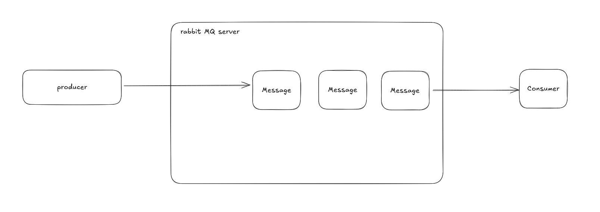

# rammit-mq-test

# How to run

1. Start docker rabbitmq server

```
docker compose up rabbitmq --build
```

2. Start consumer (receiver) server

```
go run ./consumer/consumer.go
```

3. Start producer (sender) server

```
go run ./producer/producer.go
```

And inspect the log.

# Software Architecture for this project


